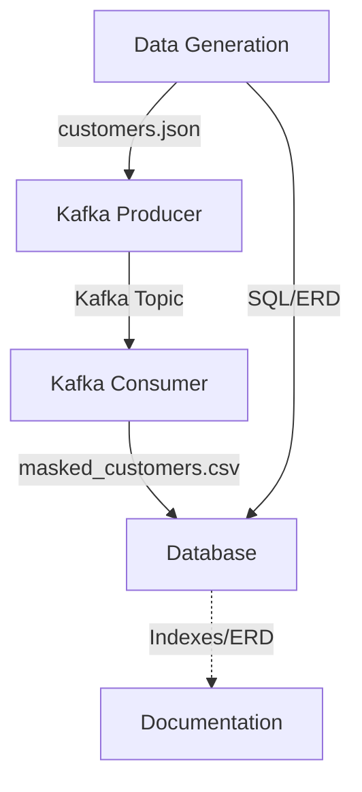
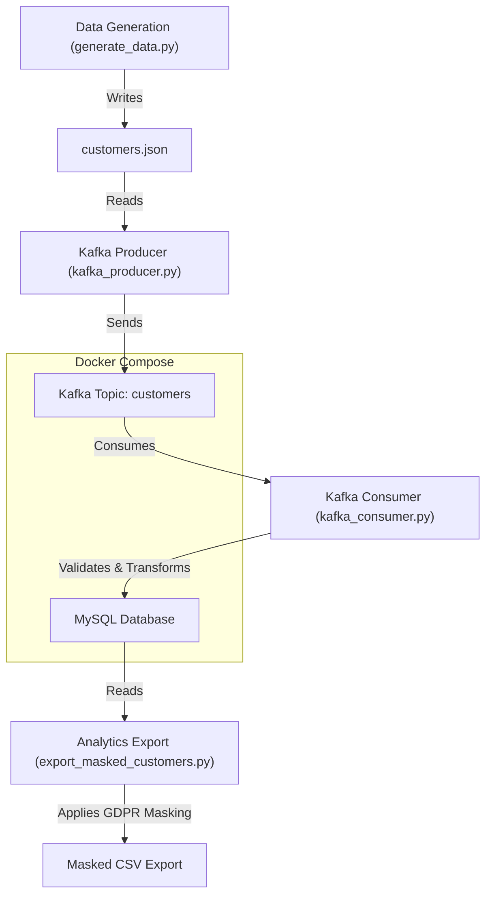

# Ecommerce Data Pipeline Project

This project demonstrates a GDPR-compliant e-commerce data pipeline using MySQL, Python, Faker, Apache Kafka, and advanced validation/masking techniques.


## Summary Diagram




## Data Pipeline Diagram




## Project Structure

```
ecommerce_project/
│
├── database/
│   └── create_tables.sql
│
├── data_generation/
│   └── generate_sample_data.py
│   └── customers.json  # (generated)
│
├── streaming/
│   ├── config.py
│   ├── kafka_producer.py
│   └── kafka_consumer.py
│
├── requirements.txt
├── docker-compose.yml
└── README.md
```

---

## Prerequisites
- **Python 3.7+**
- **MySQL Server** (running locally)
- **Apache Kafka** (running locally on `localhost:9092`)
- **Kafka topic**: `customers` (create manually if needed)
- **libpostal** (optional, for best address validation)

---

## Setup Instructions

### 1. Install Python dependencies
```bash
pip install -r requirements.txt
```
- If you want advanced address validation, install [libpostal](https://github.com/openvenues/libpostal) on your system.

### 2. Start MySQL and create the schema
```bash
mysql -u root -p < database/create_tables.sql
```

### 3. Start Kafka
- Ensure Kafka is running on `localhost:9092`.
- Create the topic `customers` if it does not exist:
  ```bash
  kafka-topics --create --topic customers --bootstrap-server localhost:9092 --partitions 1 --replication-factor 1
  ```

### 4. Generate sample data
```bash
cd data_generation
python generate_sample_data.py
```
This will create a `customers.json` file for the producer to use.

### 5. Start the Kafka consumer (in one terminal)
```bash
cd ../streaming
python kafka_consumer.py
```

### 6. Start the Kafka producer (in another terminal)
```bash
python kafka_producer.py
```

---

## What Happens
- The **producer** reads customer records from `customers.json` and streams them to the Kafka topic `customers`.
- The **consumer** reads from the topic, validates and transforms each record, and inserts valid customers into the MySQL `customers` table.
- All actions and errors are logged.

---

## Advanced Validation & GDPR Masking

### Validation Features
- **Country:** Validated and normalized using `pycountry` (ISO codes).
- **Phone:** Normalized and validated using `phonenumbers` (E.164 format, country-aware).
- **Address:** Validated using `postal` (libpostal) if available, or basic checks otherwise.
- **Email:** Regex validation, duplicate check, and (optionally) external API deliverability check.
- **Names, city:** Alphabetic checks and normalization.
- **Dates, age:** Format and range checks.

### GDPR Masking
- Sensitive fields (email, phone, address) are masked in logs and can be masked for exports/analytics.
- Masking utilities:
  - `mask_email(email)`
  - `mask_phone(phone)`
  - `mask_address(address)`
- Example usage for analytics/export:
  ```python
  masked_email = mask_email(customer['email'])
  masked_phone = mask_phone(customer['phone_number'])
  masked_address = mask_address(customer['shipping_address'])
  ```

---

## Configuration
- Edit `streaming/config.py` to change MySQL or Kafka connection settings.
- Default MySQL user is `root` with no password. Change as needed.

---

## Troubleshooting
- **MySQL connection errors:** Ensure MySQL is running and credentials are correct.
- **Kafka connection errors:** Ensure Kafka is running on `localhost:9092` and the topic exists.
- **Module not found:** Run `pip install -r requirements.txt`.
- **libpostal not found:** Address validation will fallback to basic checks.
- **Data not appearing in DB:** Check consumer logs for validation errors.

---

## Extending the Project
- Enable external email/address validation APIs for even stricter checks.
- Add Docker Compose for a fully containerized setup.
- Expand to stream other tables or use Avro/Protobuf for serialization.
- Add full pseudonymization, audit logging, or data subject access request support for GDPR.

---

## Running MySQL and Kafka with Docker Compose

You can use Docker Compose to quickly spin up MySQL and Kafka locally for development/testing.

### 1. Create a `docker-compose.yml` file in the project root:

```yaml
version: '3.8'
services:
  zookeeper:
    image: confluentinc/cp-zookeeper:7.4.0
    environment:
      ZOOKEEPER_CLIENT_PORT: 2181
      ZOOKEEPER_TICK_TIME: 2000
    ports:
      - "2181:2181"

  kafka:
    image: confluentinc/cp-kafka:7.4.0
    depends_on:
      - zookeeper
    ports:
      - "9092:9092"
    environment:
      KAFKA_BROKER_ID: 1
      KAFKA_ZOOKEEPER_CONNECT: zookeeper:2181
      KAFKA_ADVERTISED_LISTENERS: PLAINTEXT://localhost:9092
      KAFKA_OFFSETS_TOPIC_REPLICATION_FACTOR: 1

  mysql:
    image: mysql:8.0
    restart: always
    environment:
      MYSQL_ROOT_PASSWORD: 
      MYSQL_DATABASE: ecommerce_db
    ports:
      - "3306:3306"
    volumes:
      - mysql_data:/var/lib/mysql

volumes:
  mysql_data:
```

### 2. Start the services
```bash
docker-compose up -d
```

- MySQL will be available at `localhost:3306` (user: `root`, password: `example`).
- Kafka will be available at `localhost:9092`.

### 3. Create the Kafka topic (if needed)
```bash
docker exec -it $(docker ps -q -f ancestor=confluentinc/cp-kafka:7.4.0) \
  kafka-topics --create --topic customers --bootstrap-server localhost:9092 --partitions 1 --replication-factor 1
```

### 4. Load the schema and run the pipeline as described above.


